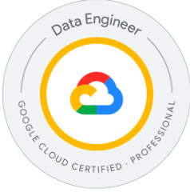
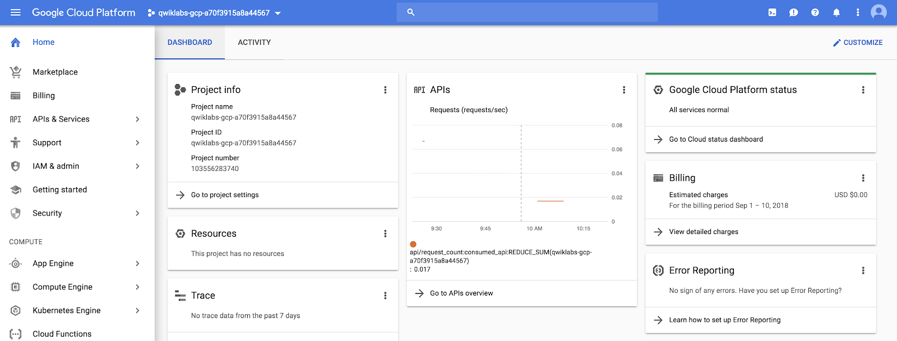
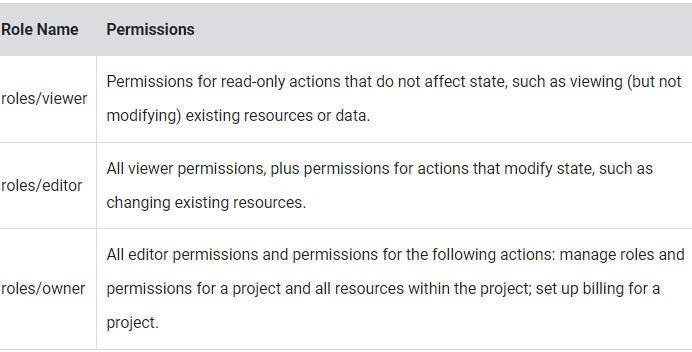
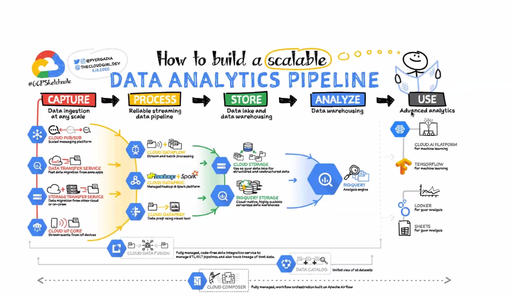
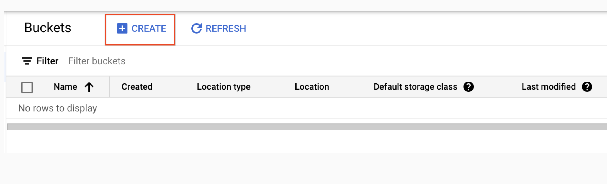
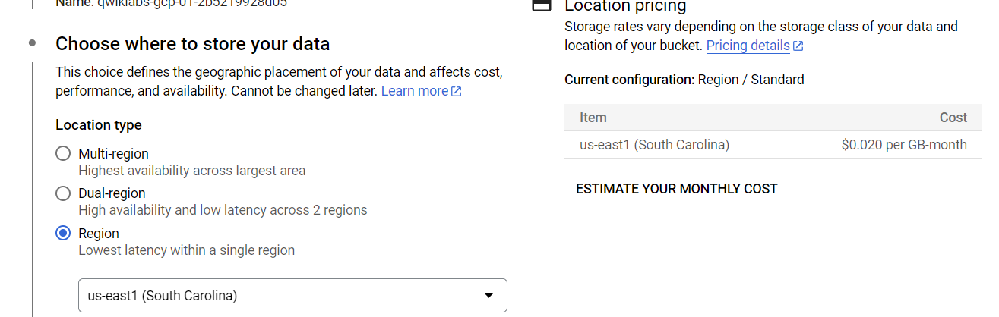
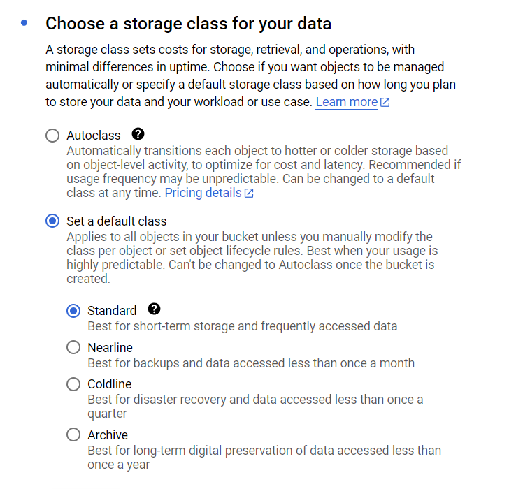
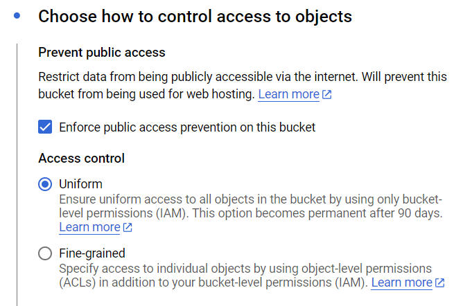
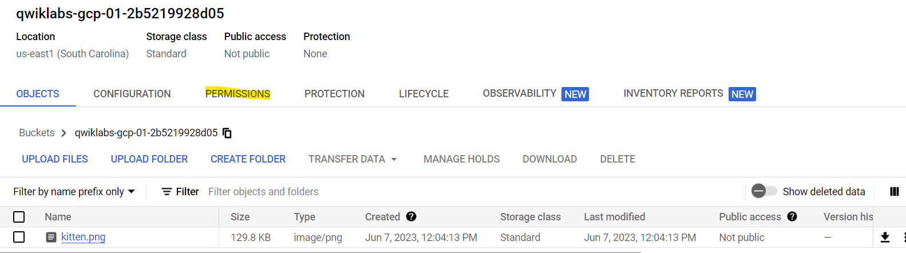
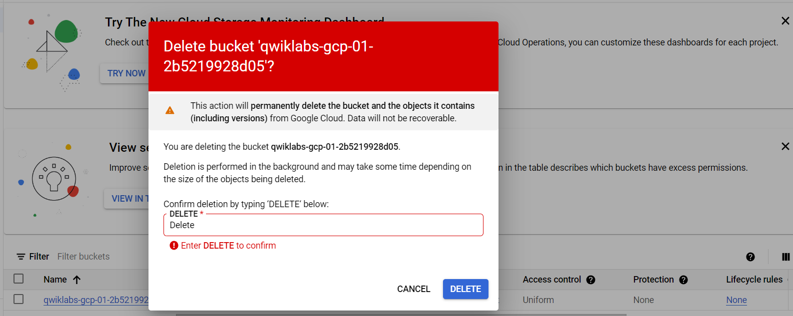

# Data Engineer GCP

## Libros
- https://www.amazon.com/-/es/Priyanka-Vergadia/dp/1119816327
https://www.oreilly.com/member/login/
- LIBRO DE DAN SULLIVAN: https://www.amazon.com/Official-Google-Certified-Professional-Engineer/dp/1119618436

## Clase 1- Introducción

### Lab. A Tour of Google Cloud Hands-on Labs
https://www.cloudskillsboost.google/focuses/2794?parent=catalog

#### Task 1. Accessing the Cloud Console

- *Project ID*: A Project ID is a unique identifier that is used to link Google Cloud resources and APIs to your specific project. Project IDs are unique across Google Cloud: there can be only one qwiklabs-gcp-xxx...., which makes it globally identifiable.

- *Username and Password*: These credentials represent an identity in the Cloud Identity and Access Management (Cloud IAM) service. This identity has access permissions (a role or roles) that allow you to work with Google Cloud resources in the project you've been allocated. These credentials are temporary and will only work for the access time of the lab. When the timer reaches 00:00:00, you will no longer have access to your Google Cloud project with those credentials.

#### Task 2. Projects in the Cloud console

- *A Google Cloud project* is an organizing entity for your Google Cloud resources. It often contains resources and services; for example, it may hold a pool of virtual machines, a set of databases, and a network that connects them together. Projects also contain settings and permissions, which specify security rules and who has access to what resources. 

The upper-left corner of the central pane contains a card labeled Project info that looks like this:

Your project has a name, number, and ID. These identifiers are frequently used when interacting with Google Cloud services. You are working with one project to get experience with a specific service or feature of Google Cloud.

#### Task 3. Roles and permissions
In addition to cloud computing services, Google Cloud also contains a collection of permissions and roles that define who has access to what resources. You can use the Cloud Identity and Access Management (Cloud IAM) service to inspect and modify these roles and permissions.

As an editor, you can create, modify, and delete Google Cloud resources. However, you can't add or delete members from Google Cloud projects.

#### Task 4. APIs and services
Google Cloud APIs are a key part of Google Cloud. Like services, the 200+ APIs, in areas that range from business administration to machine learning, all easily integrate with Google Cloud projects and applications.

Most Cloud APIs provide you with detailed information on your project’s usage of that API, including traffic levels, error rates, and even latencies, which helps you quickly triage problems with applications that use Google services.

On the Navigation menu (Navigation menu), click APIs & Services > Library. The left pane, under the header Category, displays the different categories available.

APIs are application programming interfaces that you can call directly or via the client libraries. Cloud APIs use resource-oriented design principles as described in the API Design Guide.

#### Google Cloud resources
Google Cloud consists of a set of physical assets, such as computers and hard disk drives, and virtual resources, such as virtual machines (VMs), that are contained in Google's data centers around the globe. Each data center location is in a region. Regions are available in Asia, Australia, Europe, North America, and South America. Each region is a collection of zones, which are isolated from each other within the region. Each zone is identified by a name that combines a letter identifier with the name of the region. For example, zone a in the East Asia region is named asia-east1-a.

This distribution of resources provides several benefits, including redundancy in case of failure and reduced latency by locating resources closer to clients. This distribution also introduces some rules about how resources can be used together.

### Inicio
https://gcping.com/

Hay 3 nubes: AWS, Azure, GPC.
Google tiene el mayor número de servicios para analítica.
En AWS se tienen que realizar las configuraciones de disco, ram, infraestructura y en GCP no, esto se le llama *tecnología serverless de GCP*.

El Data Engineer se encarga de ETL.
Datawarehouse es BQ.
Datalake es Cloud Storage.

### Las nubes Aprovechan Open Source
Ejemplo de GCP:
- Beam(Dataflow)
- Spark(Dataproc)
- Airflow(Compouser)

Las nubes tienen auditoría, se sabe quién, cuándo y dónde se hizo algún cambio.
Los servicios de nube internamente realizan procesos en paralelo.

### Intro a Servicios

*Big Query*: Te cobra por escanéo de data antes de realizar consulta. Por ello se debe:
- Diseñar tabla de partición.
- Clusterizar(Indice).
- Seleccionar solo datos que se necesitan.
- En caso muy extremo, llamar a GCP para limitar cuotas.
- El preview no te cobra

*Cloud Storage*: Es el corazón de un servicio de Big Data.
*Data fusion and Dataprep*: Usados para limpieza de datos.
*Dataflow and Dataproc*: Procesamiento de datos.

*Comandos*: Hay 3 comandos para usar la cloud shell:
- bq: maneja lo relacionado a Big Query.
- gsutil: controla lo de cloud storage.
- gcloud: comando para resto de servicios.

### Uso básico de GCP
- Las regiones son un conjunto de servidores que están al rededor del mundo.
- Hay que elegir región primaria y secundaria.
- Hay 4 roles básicos: Owner, Viewer, Editor, Browser.
- Los reloes se basan en el principio de mínimo privilegio.
- La transferencia de datos entre regiones se cobra.

## Clase 2. Cloud Storage
https://cloud.google.com/storage/docs/buckets?_ga=2.188584296.-1774323373.1685578005&hl=es-419#naming

### Lab. Cloud Storage: Qwik Start - Cloud Console
https://www.cloudskillsboost.google/focuses/1760?catalog_rank=%7B%22rank%22%3A3%2C%22num_filters%22%3A1%2C%22has_search%22%3Atrue%7D&parent=catalog&search_id=23942677

Cloud Storage allows world-wide storage and retrieval of any amount of data at any time. You can use Cloud Storage for a range of scenarios including serving website content, storing data for archival and disaster recovery, or distributing large data objects to users via direct download.

- It's serverless, that means we do not need to worry about the hardware, physical resources and management.
- **It's not a file system**: It simulates a FS, but everything is at the same level, 'folders' are part of the name of an object.
- You do not pay when you upload a file, You have to pay for storage, but there are other reading costs and trasfering data from different regions.
- An object must have 2 things: information and metadata.

### Task 1. Create a bucket
Buckets are the basic containers that hold your data in Cloud Storage. To create a bucket:

1. In the Cloud Console, go to Navigation menu > Cloud Storage > Buckets.
2. Click + Create:

3. Enter your bucket information and click Continue to complete each step:

     - **Name your bucket**: Enter a unique name for your bucket. For this lab, you can use your Project ID as the bucket name because it will always be unique.

**Bucket naming rules:**

- Do not include sensitive information in the bucket name, because the bucket namespace is global and publicly visible. **Every bucket must have unique name across the entire Cloud Storage namespace**.

- Bucket names must contain only lowercase letters, numbers, dashes (-), underscores (_), and dots (.). Names containing dots require verification.

- Bucket names must start and end with a number or letter.

- Bucket names must contain **3 to 63 characters**. Names containing dots can contain up to 222 characters, but each dot-separated component can be no longer than 63 characters.

- Bucket names cannot be represented as an IP address in dotted-decimal notation (for example, 192.168.5.4).

- Bucket names cannot begin with the "goog" prefix. Bucket names cannot contain "google" or close misspellings of "google".*

- Also, for DNS compliance and future compatibility, you should not use underscores (_) or have a period adjacent to another period or dash. For example, ".." or "-." or ".-" are not valid in DNS names.

4. Choose Region: Storage rates vary depending on the storage class of your data and location of your bucket.

5. Choose Storage Class: A storage class sets costs for storage, retrieval, and operations, with minimal differences in uptime. Choose if you want objects to be managed automatically or specify a default storage class based on how long you plan to store your data and your workload or use case.

We can change the storage class by setting rules. It is called **"Data Lifecycle"**.

6. Choose Access control: Restrict data from being publicly accessible via the internet. Will prevent this bucket from being used for web hosting.

#### Task 2. Upload an object into the bucket

- In the Cloud Storage browser page, click the name of the bucket that you created.

- In the Objects tab, click Upload files.

- In the file dialog, go to the file that you downloaded and select it.

After the upload completes, you should see the file name and information about the file, such as its size and type. **Object names must be unique only within a given bucket.**

#### Task 3. Share a bucket publicly
To allow public access to the bucket and create a publicly accessible URL for the image:

1. Click the Permissions tab above the list of files.

2. Ensure the view is set to Principals. Click Grant Access to view the Add principals pane.

3. In the New principals box, enter **allUsers**.

4. In the Select a role drop-down, select Cloud Storage > Storage Object Viewer.

5. Click Save.

6. In the Are you sure you want to make this resource public? window, click Allow public access.

#### Task 4. Create folders
In the Objects tab, click Create folder.

Enter folder1 for Name and click Create.

You should see the folder in the bucket with an image of a folder icon to distinguish it from objects.

#### Task 5. Delete a folder
1. Click the arrow next to Bucket details to return to the buckets level.

2. Select the bucket.

3. Click on the Delete button.

4. In the window that opens, type DELETE to confirm the deletion of the folder.

5. Click Delete to permanently delete the folder and all objects and subfolders in it.

- Object Versioning: It's only on if set it on the bucket. Every action on an object save a copy, the current object is called "Current object" and the previous ones are called "Noncurrent object". Object Versioning cannot be enabled on a bucket that currently has a retention policy.

- Retention policies and retention policy locks: It allows you to configure a data retention policy for a Cloud Storage bucket that governs how long objects in the bucket must be retained. The feature also allows you to lock the data retention policy, permanently preventing the policy from being reduced or removed.

### Lab. Datastream: PostgreSQL Replication to BigQuery

https://www.cloudskillsboost.google/focuses/53925?catalog_rank=%7B%22rank%22%3A2%2C%22num_filters%22%3A0%2C%22has_search%22%3Atrue%7D&parent=catalog&search_id=24002633

Datastream is a serverless Change Data Capture (CDC) and replication service that makes it easy to synchronize data across heterogeneous databases and applications reliably and with minimal latency. 

It supports streaming data from Oracle, MySQL and PostgreSQL databases into BigQuery and Cloud Storage. In addition to these destinations, the service offers streamlined integration by using Dataflow templates to build custom workflows for loading data into BigQuery for analytics. You can also use Datastream to replicate your databases into Cloud SQL or Cloud Spanner for database synchronization, or leverage the event stream directly from Cloud Storage to realize event-driven architectures.

It allows a wide range of use cases:
- Analytics
- DBs migrations
- Event-driven Architectures.
- AI and ML.
- Data lakes and more.

#### Experience elements
There are three main elements that comprise Datastream:

- **Private connectivity** configurations enable Datastream to communicate with a data source over a private network (internally within Google Cloud, or with external sources connected over VPN or Interconnect). This communication happens through a Virtual Private Cloud (VPC) peering connection.

- **Connection profiles** represent connectivity information to both a source and a destination. This information will be used by a stream.

- **Streams** use the information in the connection profiles to transfer CDC and backfill data from the source to the destination.

More Info:
-  In this video, we’ll show you how you can set up a data stream from Oracle to Cloud Storage. Watch to learn how Datastream can deliver change data streams in real time from your database to Google Cloud to support analytics, database replication, and event-driven architectures!
https://www.youtube.com/watch?v=FZG4w4Vbj38&t=38s

- In this video, Gabe Weiss, Developer Advocate at Google, discusses setting up real-time replication from Cloud SQL to BigQuery. Watch along and learn how to get started with Datastream for BigQuery!
https://www.youtube.com/watch?v=vMo6Zgkvt40 : 

- Documentataion: https://cloud.google.com/datastream/docs/overview

## Clase 3. Big Query

https://cloud.google.com/bigquery/docs/sandbox?hl=es-419

ROLES: https://cloud.google.com/bigquery/docs/access-control?hl=es-419#bigquery

https://classroom.google.com/c/NjEyMDAxNDI1MjEw/a/NjEyMDAxMzczODI3/details

LABORATORIO: https://classroom.google.com/c/NjEyMDAxNDI1MjEw/a/NjEyMDAxMzczODI3/details

You can do some pretty useful things with arrays like:

finding the number of elements with ARRAY_LENGTH(<array>)

deduplicating elements with ARRAY_AGG(DISTINCT <field>)

ordering elements with ARRAY_AGG(<field> ORDER BY <field>)

limiting ARRAY_AGG(<field> LIMIT 5)

You need to UNNEST() arrays to bring the array elements back into rows
UNNEST() always follows the table name in your FROM clause (think of it conceptually like a pre-joined table)

Task 5. Introduction to STRUCTs
You may have wondered why the field alias hit.page.pageTitle looks like three fields in one separated by periods. Just as ARRAY values give you the flexibility to go deep into the granularity of your fields, another data type allows you to go wide in your schema by grouping related fields together. That SQL data type is the STRUCT data type.

The easiest way to think about a STRUCT is to consider it conceptually like a separate table that is already pre-joined into your main table.

A STRUCT can have:

One or many fields in it
The same or different data types for each field
It's own alias

Storing your large reporting tables as STRUCTs (pre-joined "tables") and ARRAYs (deep granularity) allows you to:

Gain significant performance advantages by avoiding 32 table JOINs

Get granular data from ARRAYs when you need it but not be punished if you don't (BigQuery stores each column individually on disk)

Have all the business context in one table as opposed to worrying about JOIN keys and which tables have the data you need.

To recap:

Structs are containers that can have multiple field names and data types nested inside.

Arrays can be one of the field types inside of a Struct (as shown above with the splits field).