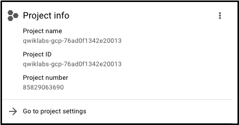

# Data Engineer GCP

## Libros
- https://www.amazon.com/-/es/Priyanka-Vergadia/dp/1119816327
https://www.oreilly.com/member/login/
- LIBRO DE DAN SULLIVAN: https://www.amazon.com/Official-Google-Certified-Professional-Engineer/dp/1119618436

## Clase 1- Introducción

### Lab 1 
https://www.cloudskillsboost.google/focuses/2794?parent=catalog
https://cloud.google.com/docs/overview/#projects

#### Task 1. Accessing the Cloud Console

- *Project ID*: A Project ID is a unique identifier that is used to link Google Cloud resources and APIs to your specific project. Project IDs are unique across Google Cloud: there can be only one qwiklabs-gcp-xxx...., which makes it globally identifiable.

- *Username and Password*: These credentials represent an identity in the Cloud Identity and Access Management (Cloud IAM) service. This identity has access permissions (a role or roles) that allow you to work with Google Cloud resources in the project you've been allocated. These credentials are temporary and will only work for the access time of the lab. When the timer reaches 00:00:00, you will no longer have access to your Google Cloud project with those credentials.

#### Task 2. Projects in the Cloud console

- *A Google Cloud project* is an organizing entity for your Google Cloud resources. It often contains resources and services; for example, it may hold a pool of virtual machines, a set of databases, and a network that connects them together. Projects also contain settings and permissions, which specify security rules and who has access to what resources. 

The upper-left corner of the central pane contains a card labeled Project info that looks like this:

Your project has a name, number, and ID. These identifiers are frequently used when interacting with Google Cloud services. You are working with one project to get experience with a specific service or feature of Google Cloud.

#### Task 3. Roles and permissions
In addition to cloud computing services, Google Cloud also contains a collection of permissions and roles that define who has access to what resources. You can use the Cloud Identity and Access Management (Cloud IAM) service to inspect and modify these roles and permissions.

As an editor, you can create, modify, and delete Google Cloud resources. However, you can't add or delete members from Google Cloud projects.

#### Task 4. APIs and services
Google Cloud APIs are a key part of Google Cloud. Like services, the 200+ APIs, in areas that range from business administration to machine learning, all easily integrate with Google Cloud projects and applications.

Most Cloud APIs provide you with detailed information on your project’s usage of that API, including traffic levels, error rates, and even latencies, which helps you quickly triage problems with applications that use Google services.

On the Navigation menu (Navigation menu), click APIs & Services > Library. The left pane, under the header Category, displays the different categories available.

APIs are application programming interfaces that you can call directly or via the client libraries. Cloud APIs use resource-oriented design principles as described in the API Design Guide.

#### Google Cloud resources
Google Cloud consists of a set of physical assets, such as computers and hard disk drives, and virtual resources, such as virtual machines (VMs), that are contained in Google's data centers around the globe. Each data center location is in a region. Regions are available in Asia, Australia, Europe, North America, and South America. Each region is a collection of zones, which are isolated from each other within the region. Each zone is identified by a name that combines a letter identifier with the name of the region. For example, zone a in the East Asia region is named asia-east1-a.

This distribution of resources provides several benefits, including redundancy in case of failure and reduced latency by locating resources closer to clients. This distribution also introduces some rules about how resources can be used together.

### Inicio
https://gcping.com/

Hay 3 nubes: AWS, Azure, GPC.
Google tiene el mayor número de servicios para analítica.
En AWS se tienen que realizar las configuraciones de disco, ram, infraestructura y en GCP no, esto se le llama *tecnología serverless de GCP*.

El Data Engineer se encarga de ETL.
Datawarehouse es BQ.
Datalake es Cloud Storage.

### Las nubes Aprovechan Open Source
Ejemplo de GCP:
- Beam(Dataflow)
- Spark(Dataproc)
- Airflow(Compouser)

Las nubes tienen auditoría, se sabe quién, cuándo y dónde se hizo algún cambio.
Los servicios de nube internamente realizan procesos en paralelo.

### Intro a Servicios

*Big Query*: Te cobra por escanéo de data antes de realizar consulta. Por ello se debe:
- Diseñar tabla de partición.
- Clusterizar(Indice).
- Seleccionar solo datos que se necesitan.
- En caso muy extremo, llamar a GCP para limitar cuotas.
- El preview no te cobra

*Cloud Storage*: Es el corazón de un servicio de Big Data.
*Data fusion and Dataprep*: Usados para limpieza de datos.
*Dataflow and Dataproc*: Procesamiento de datos.

*Comandos*: Hay 3 comandos para usar la cloud shell:
- bq: maneja lo relacionado a Big Query.
- gsutil: controla lo de cloud storage.
- gcloud: comando para resto de servicios.

### Uso básico de GCP
- Las regiones son un conjunto de servidores que están al rededor del mundo.
- Hay que elegir región primaria y secundaria.
- Hay 4 roles básicos: Owner, Viewer, Editor, Browser.
- Los reloes se basan en el principio de mínimo privilegio.
- La transferencia de datos entre regiones se cobra.

