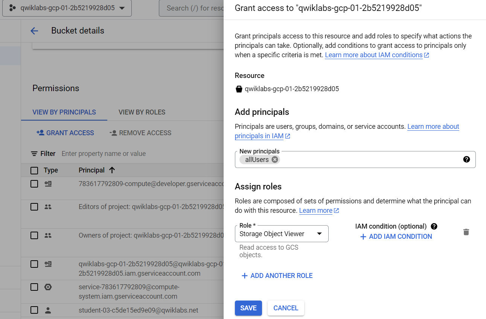
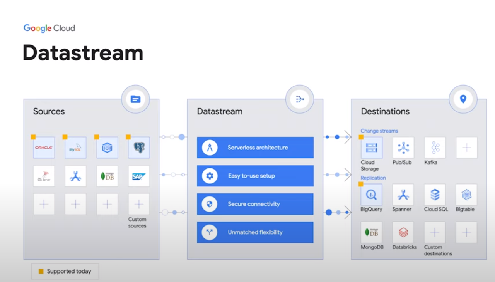

# Data Engineer GCP

## Libros
- https://www.amazon.com/-/es/Priyanka-Vergadia/dp/1119816327
https://www.oreilly.com/member/login/
- LIBRO DE DAN SULLIVAN: https://www.amazon.com/Official-Google-Certified-Professional-Engineer/dp/1119618436

## Clase 1- Introducción

### Lab. A Tour of Google Cloud Hands-on Labs
https://www.cloudskillsboost.google/focuses/2794?parent=catalog

#### Task 1. Accessing the Cloud Console

- *Project ID*: A Project ID is a unique identifier that is used to link Google Cloud resources and APIs to your specific project. Project IDs are unique across Google Cloud: there can be only one qwiklabs-gcp-xxx...., which makes it globally identifiable.

- *Username and Password*: These credentials represent an identity in the Cloud Identity and Access Management (Cloud IAM) service. This identity has access permissions (a role or roles) that allow you to work with Google Cloud resources in the project you've been allocated. These credentials are temporary and will only work for the access time of the lab. When the timer reaches 00:00:00, you will no longer have access to your Google Cloud project with those credentials.

#### Task 2. Projects in the Cloud console

- *A Google Cloud project* is an organizing entity for your Google Cloud resources. It often contains resources and services; for example, it may hold a pool of virtual machines, a set of databases, and a network that connects them together. Projects also contain settings and permissions, which specify security rules and who has access to what resources. 

The upper-left corner of the central pane contains a card labeled Project info that looks like this:

Your project has a name, number, and ID. These identifiers are frequently used when interacting with Google Cloud services. You are working with one project to get experience with a specific service or feature of Google Cloud.

#### Task 3. Roles and permissions
In addition to cloud computing services, Google Cloud also contains a collection of permissions and roles that define who has access to what resources. You can use the Cloud Identity and Access Management (Cloud IAM) service to inspect and modify these roles and permissions.

As an editor, you can create, modify, and delete Google Cloud resources. However, you can't add or delete members from Google Cloud projects.

#### Task 4. APIs and services
Google Cloud APIs are a key part of Google Cloud. Like services, the 200+ APIs, in areas that range from business administration to machine learning, all easily integrate with Google Cloud projects and applications.

Most Cloud APIs provide you with detailed information on your project’s usage of that API, including traffic levels, error rates, and even latencies, which helps you quickly triage problems with applications that use Google services.

On the Navigation menu (Navigation menu), click APIs & Services > Library. The left pane, under the header Category, displays the different categories available.

APIs are application programming interfaces that you can call directly or via the client libraries. Cloud APIs use resource-oriented design principles as described in the API Design Guide.

#### Google Cloud resources
Google Cloud consists of a set of physical assets, such as computers and hard disk drives, and virtual resources, such as virtual machines (VMs), that are contained in Google's data centers around the globe. Each data center location is in a region. Regions are available in Asia, Australia, Europe, North America, and South America. Each region is a collection of zones, which are isolated from each other within the region. Each zone is identified by a name that combines a letter identifier with the name of the region. For example, zone a in the East Asia region is named asia-east1-a.

This distribution of resources provides several benefits, including redundancy in case of failure and reduced latency by locating resources closer to clients. This distribution also introduces some rules about how resources can be used together.

### Introduction
https://gcping.com/

There are 3 clouds: AWS, Azure, GCP.
Google has the largest number of services for analytics.
In AWS, disk, RAM, and infrastructure configurations need to be done, while in GCP, this is called GCP's serverless technology.

The Data Engineer is responsible for ETL.
Data warehouse is BigQuery (BQ).
Data lake is Cloud Storage.

### Clouds Utilize Open Source
Example in GCP:

- Beam (Dataflow)
- Spark (Dataproc)
- Airflow (Composer)

Clouds have auditing, so you know who, when, and where a change was made.
Cloud services internally perform processes in parallel.

### Introduction to Services
**BigQuery**: You are charged for data scanning before executing queries. To optimize costs:
- Design partitioned tables.
- Clustering (Index).
- Select only the necessary data.
- In extreme cases, contact GCP to limit quotas.
- Preview does not incur charges.

**Cloud Storage**: It is the heart of a Big Data service.
**Data Fusion and Dataprep**: Used for data cleansing.
**Dataflow and Dataproc**: Data processing.

**Commands**: There are 3 commands to use in the Cloud Shell:
- bq: handles BigQuery-related tasks.
- gsutil: controls Cloud Storage.
- gcloud: command for other services.

### Basic Usage of GCP
- Regions are sets of servers located around the world.
- Choose a primary and secondary region.
- There are 4 basic roles: Owner, Viewer, Editor, Browser.
- Roles are based on the principle of least privilege.
- Data transfer between regions incurs charges.

## Clase 2. Cloud Storage
https://cloud.google.com/storage/docs/buckets?_ga=2.188584296.-1774323373.1685578005&hl=es-419#naming

### Lab. Cloud Storage: Qwik Start - Cloud Console
https://www.cloudskillsboost.google/focuses/1760?catalog_rank=%7B%22rank%22%3A3%2C%22num_filters%22%3A1%2C%22has_search%22%3Atrue%7D&parent=catalog&search_id=23942677

Cloud Storage allows world-wide storage and retrieval of any amount of data at any time. You can use Cloud Storage for a range of scenarios including serving website content, storing data for archival and disaster recovery, or distributing large data objects to users via direct download.

- It's serverless, that means we do not need to worry about the hardware, physical resources and management.
- **It's not a file system**: It simulates a FS, but everything is at the same level, 'folders' are part of the name of an object.
- You do not pay when you upload a file, You have to pay for storage, but there are other reading costs and trasfering data from different regions.
- An object must have 2 things: information and metadata.

### Task 1. Create a bucket
Buckets are the basic containers that hold your data in Cloud Storage. To create a bucket:

1. In the Cloud Console, go to Navigation menu > Cloud Storage > Buckets.
2. Click + Create:

3. Enter your bucket information and click Continue to complete each step:

     - **Name your bucket**: Enter a unique name for your bucket. For this lab, you can use your Project ID as the bucket name because it will always be unique.

**Bucket naming rules:**

- Do not include sensitive information in the bucket name, because the bucket namespace is global and publicly visible. **Every bucket must have unique name across the entire Cloud Storage namespace**.

- Bucket names must contain only lowercase letters, numbers, dashes (-), underscores (_), and dots (.). Names containing dots require verification.

- Bucket names must start and end with a number or letter.

- Bucket names must contain **3 to 63 characters**. Names containing dots can contain up to 222 characters, but each dot-separated component can be no longer than 63 characters.

- Bucket names cannot be represented as an IP address in dotted-decimal notation (for example, 192.168.5.4).

- Bucket names cannot begin with the "goog" prefix. Bucket names cannot contain "google" or close misspellings of "google".*

- Also, for DNS compliance and future compatibility, you should not use underscores (_) or have a period adjacent to another period or dash. For example, ".." or "-." or ".-" are not valid in DNS names.

4. Choose Region: Storage rates vary depending on the storage class of your data and location of your bucket.

5. Choose Storage Class: A storage class sets costs for storage, retrieval, and operations, with minimal differences in uptime. Choose if you want objects to be managed automatically or specify a default storage class based on how long you plan to store your data and your workload or use case.

We can change the storage class by setting rules. It is called **"Data Lifecycle"**.

6. Choose Access control: Restrict data from being publicly accessible via the internet. Will prevent this bucket from being used for web hosting.

#### Task 2. Upload an object into the bucket

- In the Cloud Storage browser page, click the name of the bucket that you created.

- In the Objects tab, click Upload files.

- In the file dialog, go to the file that you downloaded and select it.

After the upload completes, you should see the file name and information about the file, such as its size and type. **Object names must be unique only within a given bucket.**

#### Task 3. Share a bucket publicly
To allow public access to the bucket and create a publicly accessible URL for the image:

1. Click the Permissions tab above the list of files.

2. Ensure the view is set to Principals. Click Grant Access to view the Add principals pane.

3. In the New principals box, enter **allUsers**.

4. In the Select a role drop-down, select Cloud Storage > Storage Object Viewer.

5. Click Save.

6. In the Are you sure you want to make this resource public? window, click Allow public access.

#### Task 4. Create folders
In the Objects tab, click Create folder.

Enter folder1 for Name and click Create.

You should see the folder in the bucket with an image of a folder icon to distinguish it from objects.

#### Task 5. Delete a folder
1. Click the arrow next to Bucket details to return to the buckets level.

2. Select the bucket.

3. Click on the Delete button.

4. In the window that opens, type DELETE to confirm the deletion of the folder.

5. Click Delete to permanently delete the folder and all objects and subfolders in it.

- Object Versioning: It's only on if set it on the bucket. Every action on an object save a copy, the current object is called "Current object" and the previous ones are called "Noncurrent object". Object Versioning cannot be enabled on a bucket that currently has a retention policy.

- Retention policies and retention policy locks: It allows you to configure a data retention policy for a Cloud Storage bucket that governs how long objects in the bucket must be retained. The feature also allows you to lock the data retention policy, permanently preventing the policy from being reduced or removed.

### Lab. Datastream: PostgreSQL Replication to BigQuery

https://www.cloudskillsboost.google/focuses/53925?catalog_rank=%7B%22rank%22%3A2%2C%22num_filters%22%3A0%2C%22has_search%22%3Atrue%7D&parent=catalog&search_id=24002633

Datastream is a serverless Change Data Capture (CDC) and replication service that makes it easy to synchronize data across heterogeneous databases and applications reliably and with minimal latency. 

It supports streaming data from Oracle, MySQL and PostgreSQL databases into BigQuery and Cloud Storage. In addition to these destinations, the service offers streamlined integration by using Dataflow templates to build custom workflows for loading data into BigQuery for analytics. You can also use Datastream to replicate your databases into Cloud SQL or Cloud Spanner for database synchronization, or leverage the event stream directly from Cloud Storage to realize event-driven architectures.

It allows a wide range of use cases:
- Analytics
- DBs migrations
- Event-driven Architectures.
- AI and ML.
- Data lakes and more.

#### Experience elements
There are three main elements that comprise Datastream:

- **Private connectivity** configurations enable Datastream to communicate with a data source over a private network (internally within Google Cloud, or with external sources connected over VPN or Interconnect). This communication happens through a Virtual Private Cloud (VPC) peering connection.

- **Connection profiles** represent connectivity information to both a source and a destination. This information will be used by a stream.

- **Streams** use the information in the connection profiles to transfer CDC and backfill data from the source to the destination.

More Info:
-  In this video, we’ll show you how you can set up a data stream from Oracle to Cloud Storage. Watch to learn how Datastream can deliver change data streams in real time from your database to Google Cloud to support analytics, database replication, and event-driven architectures!
https://www.youtube.com/watch?v=FZG4w4Vbj38&t=38s

- In this video, Gabe Weiss, Developer Advocate at Google, discusses setting up real-time replication from Cloud SQL to BigQuery. Watch along and learn how to get started with Datastream for BigQuery!
https://www.youtube.com/watch?v=vMo6Zgkvt40 : 

- Documentation: https://cloud.google.com/datastream/docs/overview

## Clase 3. Big Query

BigQuery is a fully managed enterprise data warehouse that helps you manage and analyze your data with built-in features like machine learning, geospatial analysis, and business intelligence. BigQuery's serverless architecture lets you use SQL queries to answer your organization's biggest questions with zero infrastructure management. BigQuery's scalable, distributed analysis engine lets you query terabytes in seconds and petabytes in minutes.

BigQuery maximizes flexibility by separating the compute engine that analyzes your data from your storage choices. 

https://cloud.google.com/bigquery/docs/sandbox?hl=es-419

### BigQuery predefined IAM roles
The following table lists the predefined BigQuery IAM roles with a corresponding list of all the permissions each role includes. Note that every permission is applicable to a particular resource type.
https://cloud.google.com/bigquery/docs/access-control?hl=es-419#bigquery

### GoogleSQL data types
GoogleSQL lets you specify the following data types in your schema. Data type is required. https://cloud.google.com/bigquery/docs/schemas#standard_sql_data_types

### Lab. Using BigQuery in the Google Cloud Console

https://www.cloudskillsboost.google/focuses/3616?catalog_rank=%7B%22rank%22%3A9%2C%22num_filters%22%3A1%2C%22has_search%22%3Atrue%7D&parent=catalog&search_id=23942610

Using BigQuery in the Cloud Console will give you a visual interface to complete tasks like running queries, loading data, and exporting data. This hands-on lab shows you how to query tables in a public dataset and how to load sample data into BigQuery through the Cloud Console.

#### Task 1. Open BigQuery
The BigQuery console provides an interface to query tables, including public datasets offered by BigQuery.

1. Open the BigQuery console
In the Google Cloud Console, select Navigation menu > BigQuery.
The Welcome to BigQuery in the Cloud Console message box opens. This message box provides a link to the quickstart guide and the release notes.

2. Click Done.
The BigQuery console opens.

#### Task 2. Query a public dataset
In this section, you load a public dataset, USA Names, into BigQuery, then query the dataset to determine the most common names in the US between 1910 and 2013.

1. Load USA Name dataset
In the left pane, click + ADD DATA.

2. In ADD Data window, select Star a project by name.

3. Enter project name as bigquery-public-data and click STAR.

The project bigquery-public-data is added to your resources and you see the dataset usa_names listed in the left pane in your Explorer section under bigquery-public-data.

4. Click usa_names to expand the dataset.

5. Click usa_1910_2013 to open that table.

6. Query the USA Names dataset

Query bigquery-public-data.usa_names.usa_1910_2013 for the name and gender of the babies in this dataset, and then list the top 10 names in descending order.

BigQuery displays a green check mark icon if the query is valid. If the query is invalid, a red exclamation point icon is displayed. When the query is valid, the validator also shows the amount of data the query processes when you run it. This helps to determine the cost of running the query.

The query results opens below the Query editor. At the top of the Query results section, BigQuery displays the time elapsed and the data processed by the query. Below the time is the table that displays the query results. The header row contains the name of the column as specified in GROUP BY in the query.

#### Task 4. Create a dataset
In this section, you create a dataset to hold your table, add data to your project, then make the data table you'll query against.

Datasets help you control access to tables and views in a project. This lab uses only one table, but you still need a dataset to hold the table.

1. Back in the console, in the Explorer section, click on the View actions icon next to your project ID and select Create dataset.

2. On the Create dataset page:
   - For Dataset ID, enter babynames.
   - For Data location, choose us (multiple regions in United States).
   - For Default table expiration, leave the default value.

Currently, the public datasets are stored in the US multi-region location. For simplicity, place your dataset in the same location.

#### Task 5. Load the data into a new table
In this section, you load data into the table you made.

1. Create a table by clicking on the View actions icon next to your babynames dataset in the Explorer section. Select Open, then click Create table.
Use the default values for all settings unless otherwise indicated.

2. On the Create table page:

   - For Create table from, choose Upload from the dropdown menu.
   - For Select file, click Browse, navigate to the yob2014.txt file and click Open.
   - For File format, choose CSV from the dropdown menu.
   - For Table name, enter names_2014.
   - In the Schema section, click the Edit as text toggle and paste the following schema definition in the text box.

#### Task 6. Query the table

Now that you've loaded data into your table, you can run queries against it. The process is identical to the previous example, except that this time, you're querying your table instead of a public table.

In the Query editor, click Compose new query.

Copy and paste the following query into the query EDITOR. This query retrieves the top 5 baby names for US males in 2014.

### Lab.  Working with JSON, Arrays, and Structs in BigQuery
https://www.cloudskillsboost.google/focuses/3696?parent=catalog

In this lab you will work in-depth with semi-structured data (ingesting JSON, Array data types) inside of BigQuery. Denormalizing your schema into a single table with nested and repeated fields can yield performance improvements, but the SQL syntax for working with array data can be tricky. You will practice loading, querying, troubleshooting, and unnesting various semi-structured datasets.

#### Task 2. Practice working with arrays in SQL

In traditional relational database SQL, you would look at the repetition of names and immediately think of splitting the above table into two separate tables: Fruit Items and People. That process is called normalization (going from one table to many). This is a common approach for transactional databases like mySQL.

For data warehousing, data analysts often go the reverse direction (denormalization) and bring many separate tables into one large reporting table.

Now, you're going to learn a different approach that stores data at different levels of granularity all in one table using repeated fields:

What looks strange about the previous table?

It's only two rows.
There are multiple field values for Fruit in a single row.
The people are associated with all of the field values.
What the key insight? The array data type!

An easier way to interpret the Fruit array:

Both of these tables are exactly the same. There are two key learnings here:

An array is simply a list of items in brackets [ ]
BigQuery visually displays arrays as flattened. It simply lists the value in the array vertically (note that all of those values still belong to a single row)

**Data in an array [ ] must all be the same type**: Arrays can only share one data type (all strings, all numbers).

**Recap**

- BigQuery natively supports arrays
- Array values must share a data type
- Arrays are called REPEATED fields in BigQuery

You can do some pretty useful things with arrays like:

finding the number of elements with ARRAY_LENGTH(<array>)

deduplicating elements with ARRAY_AGG(DISTINCT <field>)

ordering elements with ARRAY_AGG(<field> ORDER BY <field>)

limiting ARRAY_AGG(<field> LIMIT 5)

You need to UNNEST() arrays to bring the array elements back into rows
UNNEST() always follows the table name in your FROM clause (think of it conceptually like a pre-joined table)

Task 5. Introduction to STRUCTs
You may have wondered why the field alias hit.page.pageTitle looks like three fields in one separated by periods. Just as ARRAY values give you the flexibility to go deep into the granularity of your fields, another data type allows you to go wide in your schema by grouping related fields together. That SQL data type is the STRUCT data type.

The easiest way to think about a STRUCT is to consider it conceptually like a separate table that is already pre-joined into your main table.

A STRUCT can have:

One or many fields in it
The same or different data types for each field
It's own alias

Storing your large reporting tables as STRUCTs (pre-joined "tables") and ARRAYs (deep granularity) allows you to:

Gain significant performance advantages by avoiding 32 table JOINs

Get granular data from ARRAYs when you need it but not be punished if you don't (BigQuery stores each column individually on disk)

Have all the business context in one table as opposed to worrying about JOIN keys and which tables have the data you need.

To recap:

Structs are containers that can have multiple field names and data types nested inside.

Arrays can be one of the field types inside of a Struct (as shown above with the splits field).

More Info:

- Welcome to BigQuery Spotlight, where we’ll be showing you all the ins and outs of BigQuery, Google’s fully-managed data warehouse. In this episode, we’ll start with an overview of BigQuery. More importantly, we’ll go over how BigQuery is designed to ingest and store large amounts of data, and make that data accessible for fast, large-scale analytics - to help analysts and developers alike. https://www.youtube.com/watch?v=d3MDxC_iuaw&list=PLIivdWyY5sqLAbIdmcMwsxWg-w8Px34MS

- Build Series - Episode 4: How to get started with BigQuery. https://www.youtube.com/watch?v=BH_7_zVk5oM

- How does BigQuery store data?. https://www.youtube.com/watch?v=0Hd23GnZ1bE

- Documentation: https://cloud.google.com/bigquery/docs/introduction
